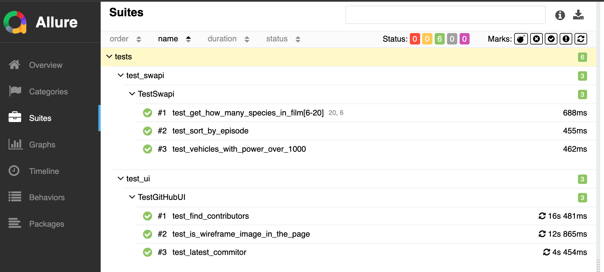

# Hahow - interview homework

## How to contribute

Setup requirement packages

```bash
pip install -r requirements.txt
```

## Linter

run `make check` every time when you create a PR and make sure the linter is passed.
You can use the linter check when you create PR request

## Execution

`pytest tests/`

- If you want to generate allure report

`pytest tests/ --alluredir=./reports`

and you can generate report on local `allure serve reports`
or Using Jenkins plugin to show the report


